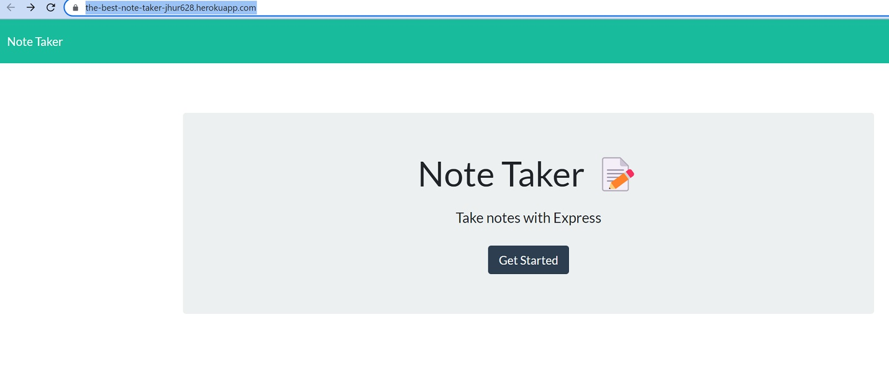
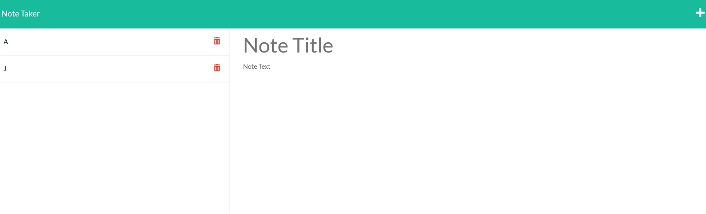
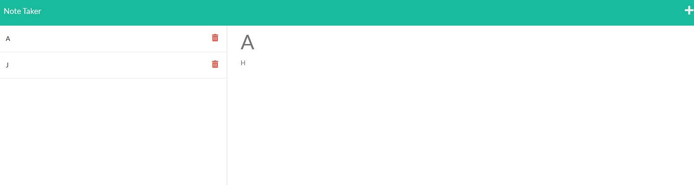

# The Best Note Taker

  ## Description
  I made the Best Note Taker.

  The application has been deployed via Heroku. When the application is loaded at https://the-best-note-taker-jhur628.herokuapp.com/, the user is presented with a button that says "get started". When the button is clicked, the user is taken to https://the-best-note-taker-jhur628.herokuapp.com/notes. The user will be presented with a note taker.

  When the user adds text to the "Note Title" and "Note Text" sections a save button will appear on the top right part of the page next to the "+" button. When the user finishes making a noted, the user can use the save button to render the note to the left side of the page.

  The notes on the left side of the page may be clicked to show on the right side of the page. When the user clicks the trash icon, the note will be deleted and the updated note list will be rendered to the left side of the page.

  When the user clicks the "+" button on the top right of the page, the user may add a new note to fill in and save.

  Enjoy.

  GitHub Repository: [https://github.com/jhur628/theBestNoteTaker](https://github.com/jhur628/theBestNoteTaker)
  
  Deployed Heroku Application: [https://the-best-note-taker-jhur628.herokuapp.com/](https://the-best-note-taker-jhur628.herokuapp.com/)
  
  ## Table of Contents
  ### [Installation](#Installation)
  ### [Usage](#Usage)
  ### [Credits](#Credits)
  ### [Questions](#Questions)
  ### [Screenshots](#Screenshots)

  ## Installation
  No installation required. Just load the deployed application at https://the-best-note-taker-jhur628.herokuapp.com/.
  ## Usage
  This application will help make notes and delete notes to help the user throughout his busy work day.
  ## Credits
  My peers were a big help. I'm very grateful to them. Thank goodness for study groups. I also had a lot of help from my TA, Pat. Thanks a bunch, Pat!
  ## Questions
  Have any questions?  
  Contact me at hur.john628.com.  
  Github: https://github.com/jhur628/  
  ## Screenshots
  
  
  